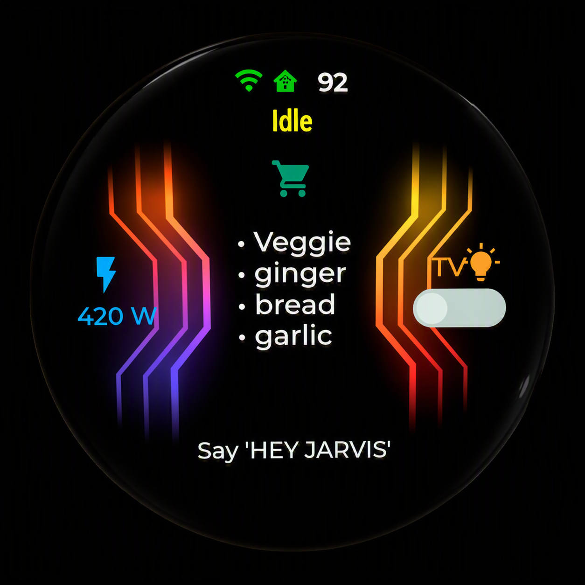
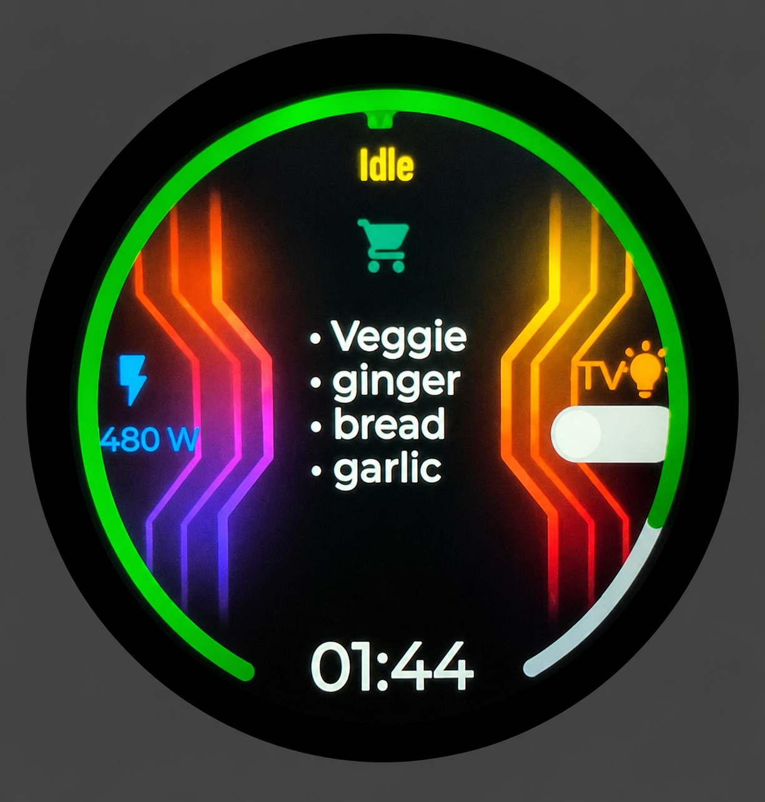
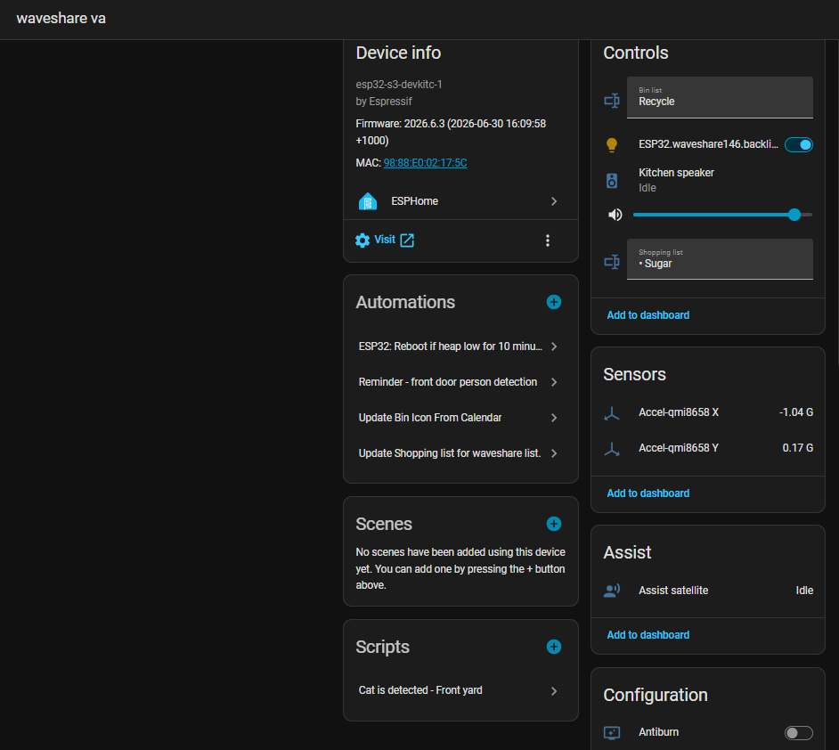

# waveshare-lcd-1.46-touch

Device: https://www.waveshare.com/wiki/ESP32-S3-Touch-LCD-1.46B
This project is for esphome, download the three files in components/spd2010_touch folder and put it into esphome/components/esp2010_touch

Added external component spd2010_touch, which glues the official lcd_touch driver and lcd_touch_spd2010.

```yaml
esphome:
  name: waveshare-146-va
  friendly_name: waveshare 146 va 1.2
  on_boot:
    - priority: -100
      #initialize the touch driver
      then:
        - delay: 300ms
        - lambda: |-
            id(spd2010_touch_driver).begin();
 
external_components:
  #- source: components #  Use this for local developement
  - source: github://chickymonkey/waveshare-lcd-1.46-touch
    components: [spd2010_touch]
    refresh: 1h

spd2010_touch:
  id: spd2010_touch_driver
  i2c_id: bus_imu_touch_rtc
  width: 412
  height: 412
  int_gpio: 4       # plain integer; we handle GPIO internally
  swap_xy: false
  mirror_x: true
  mirror_y: true
 

```
## Functions
- Voice assistant ( potentially to add items onto the shopping list, control media player)
- shoppint list active items
- Showing home current energy (needs your own sensor)
- Switch for a light, or any light
- Touch screen function for lvgl.
- Media page and main page switch by swipping left or right
- Accellerator sensor (potentially can be used to switch pages or control volume ?)

## Shopping list
My device works as a fridge magenet, so I put shopping list in the middle.
Find the text sensor from the device, and create below automation in HA to sync shopping list item through.


```yaml
alias: Update Shopping list for waveshare list.
description: ""
triggers:
  - trigger: time_pattern
    seconds: /20
conditions: []
actions:
  - action: todo.get_items
    metadata: {}
    data:
      status: needs_action
    target:
      entity_id: todo.shopping_list
    response_variable: shopping_list_items
  - action: text.set_value
    metadata: {}
    target:
      entity_id: text.waveshare_va_shopping_list
    data:
      value: >-
        

             
          {{ '\u2022 ' ~ (items | map(attribute='summary') | list | join('\n\u2022 ')) }}     
        
          Empty      
        
mode: single
```
## Preview

<p align="center">
  
</p>

<p align="center">
  
</p>

<p align="center">
  
</p>
<p align="center">
  
</p>
